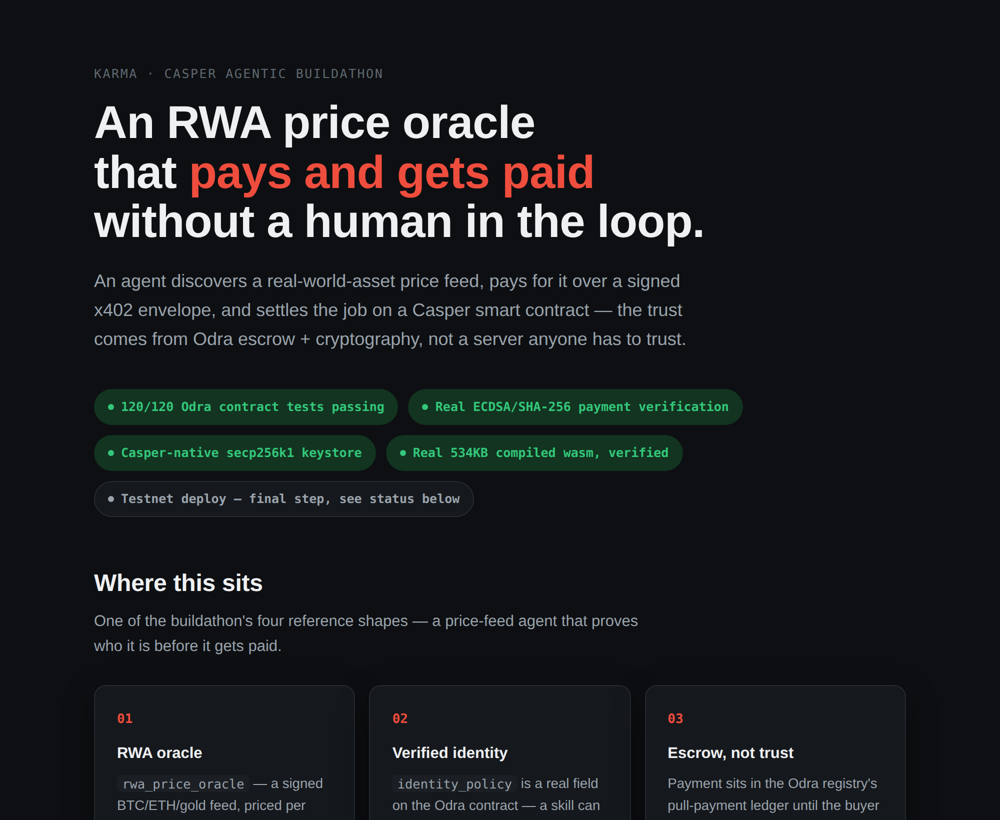

# KARMA

> 🤖 **Judging this for the Casper Agentic Buildathon?** Start with
> [DEMO_CASPER.md](DEMO_CASPER.md), or the
> [90-second walkthrough](https://eilodon.github.io/KARMA-Eilodon/media/casper-judges.html) if you
> want the short version first — no clone needed.

> [](https://eilodon.github.io/KARMA-Eilodon/media/casper-judges.html)
>
> The pitch in one line: an RWA price-oracle agent discovers a skill, pays for it with a real
> signed x402 envelope, and settles the job on an Odra `AgentSkillRegistry` — trust that comes from
> escrow and cryptography, not a server you have to take our word for. Every terminal panel in that
> walkthrough is a real captured run, not typed-out copy. Reproduce it yourself:
> `pnpm exec tsx src/scripts/demo_casper_x402_live.ts` runs the actual local HTTP 402 → pay → verify
> loop, `cargo +nightly test --manifest-path contracts-odra/Cargo.toml` gets you 155/155, and
> `contracts-odra/build-wasm.sh` builds the same ~535KB `karma_odra.wasm` (WebAssembly.validate()-
> clean, every entry point exported) that's live on Testnet right now at `hash-42f6945f…`
> (attestation-hardened redeploy, 2026-07-21 — tx-by-tx evidence in [DEMO_CASPER.md](DEMO_CASPER.md)).
> Governance is a real 2-of-2 multisig with a 48h timelock, and we didn't just take that on faith
> from the deploy args — we decoded `governance_signers`/`governance_threshold`/`timelock_delay`
> straight out of the contract's own storage to confirm it.

> **New this Buildathon, proven live the same day it shipped:** a requester can now commit a hash
> of their agent's decision rationale on-chain (`attest_rationale`) and read it back byte-for-byte
> (`get_rationale_hash`); attesting the same job twice, or attesting someone else's job, both
> revert correctly (`RationaleAlreadyAttested`, `NotRequester`). That's Casper's own "verifiable AI
> outputs" ask, answered with an on-chain anchor instead of an LLM response that vanishes the
> moment the session ends. Four more flows got re-run fresh against the new contract, 23 real
> transactions in total, all logged in [DEMO_CASPER.md](DEMO_CASPER.md): the full job lifecycle
> (register → bond → escrow → deliver → confirm → withdraw, reputation actually moving on-chain);
> the courtroom flow for real — a requester disputes, the provider matches the bond, a neutral
> on-chain arbiter (a genuinely separate account) rules `ProviderAtFault`, reputation *actually*
> drops `50 → 40` and escrow *actually* gets refunded, one take, no retries; and a governed
> cross-chain-reputation proposal that correctly rejects an early execute against the real 48-hour
> clock (`TimelockNotElapsed`).
>
> 🎬 [Watch the ~2:18 narrated video](docs/media/casper-demo-video.mp4) — captured against the prior
> contract (`hash-29b7daeb…`, since superseded by the redeploy above). Same mechanism, re-proven
> fresh above; nothing in the video changed, we just moved house.

> **Not a single-chain app.** The same identity/reputation/settlement model running on Casper above
> also runs on **Stellar** — a Groth16/BN254 zero-knowledge reputation gate, verified on-chain by
> Soroban's native host functions (CAP-0074), settling per call in USDC over x402. Architecture and
> live contracts are under
> [Zero-knowledge reputation gating](#architecture-zero-knowledge-reputation-gating-proven-on-stellar)
> below; full write-up in [DEMO_STELLAR.md](DEMO_STELLAR.md).

> **What predates this Buildathon, said plainly instead of buried:** the protocol core — the
> identity/reputation/escrow/dispute spec, the MCP runtime under `src/core`, `src/mcp`,
> `src/middlewares` — and the Pharos and Stellar implementations were built before the Casper track
> opened. Everything Casper-specific is new for this submission: the Odra `AgentSkillRegistry`
> (`contracts-odra/`, 155 Rust tests), the secp256k1 keystore adapter, the `x402_casper.ts` payment
> rail, `live_client.ts`'s real transaction building against `casper-js-sdk`, the 46-tool
> `casper.tool.ts` MCP surface, the governance-hardened redeploy, and every transaction recorded in
> [DEMO_CASPER.md](DEMO_CASPER.md). A pre-existing base is fine to disclose and not fine to hide —
> so it's disclosed, and the part actually being judged here is original and shipped now.

A protocol for agent economies, not a single-chain app. Agents publish skills, get discovered by
relevance and reputation, and invoke each other under trust gates that are actually enforced —
identity, reputation, settlement — specified once and implemented per chain. All of it runs on
**SUPER-MCP** (Layer 0, bundled here under `src/core`, `src/mcp`, `src/middlewares`, `src/storage`),
a hardened TypeScript/ESM MCP server.

**KARMA is a spec with reference implementations, not a spec with one implementation.**
[`docs/standards/`](docs/standards/) defines `IPaymentPlugin v1` (a 3-method settlement interface —
`quote` / `pay` / `verify`) and a public, PR-governed `IdentityPolicy` registry. Casper conforms to
that interface at v1.0 — governance-hardened, deployed and verified end-to-end on Testnet (see
[Live deployment](#live-deployment) and [DEMO_CASPER.md](DEMO_CASPER.md)) — and so does Stellar (see
[reference-implementations.md](docs/standards/reference-implementations.md)); Pharos is the
original chain the spec was extracted from. Landing a new chain adapter follows a documented
playbook we estimate at 1–2 sessions, not months. That's the actual bet: this isn't "KARMA also
runs on your chain," it's "your chain becomes a conformant node in a protocol that already runs on
others" — and Casper's deployment is the one every later adopter in this ecosystem has to
interoperate with.

**On Casper, this is the deepest implementation we've shipped.** Identity gate, reputation, escrow,
symmetric-bond dispute arbitration with a neutral on-chain arbiter, multisig+timelock governance,
and weighted skill composition — all live on Testnet, 155 Rust tests (incl. property-based
escrow/reputation invariants), real transactions end to end
(register → bond → escrow → deliver → dispute → arbitrate → withdraw). Full story and tx-by-tx
evidence: [DEMO_CASPER.md](DEMO_CASPER.md).

Sitting next to that single-arbiter path, and never replacing it, is an opt-in N-of-M panel mode:
a requester can ask for an odd-sized panel of independent arbiters instead of one, a dispute
settles the moment a strict majority agrees, and every arbiter who votes gets paid regardless of
which side they land on (so there's no incentive to just copy the expected majority). It shares
the exact same fund-movement code as the single-arbiter path, so the two can't drift apart on a
payout bug. It's real, tested code — 155/155 includes the panel path — but it landed a day after
the currently deployed contract, so it isn't on Testnet yet; redeploying it is the next concrete
step, tracked in [Roadmap & team](#roadmap--team).

The same skill/identity/reputation model is also proven end-to-end on **Stellar** (zero-knowledge
reputation gating via Groth16/BN254, live Soroban verifiers) and **Pharos** (Solidity escrow +
reputation, live contract, 96 Foundry tests), gating identity through the **Terminal3 Agent Auth
SDK** where a chain supports server-mediated identity. Real, tested proof the spec holds up outside
Casper — details in [DEMO_STELLAR.md](DEMO_STELLAR.md) · [DEMO.md](DEMO.md) ·
[docs/RUNTIME.md](docs/RUNTIME.md).

---

## Fit to the Casper Agentic Buildathon

Casper's own framing for this track: **["Casper is the trust layer for the agent economy"](https://www.casper.network/ai)**.
The AI Toolkit already gives agents a way to *pay* (x402) — it doesn't yet give them a way to
*trust*: identity, reputation, a real verdict when a counterparty cheats. That's the gap KARMA
fills, and it's wired directly into Casper's own x402/MCP stack instead of sitting next to it.

It's also close to a literal build of the Buildathon brief's own **"RWA Oracle Agent with
Verifiable On-Chain Identity"** example
([full text](https://dorahacks.io/hackathon/casper-agentic-buildathon-finals/detail)): an agent
posts verified off-chain data on-chain via x402, backed by an on-chain identity and a reputation
score built from historical accuracy — a trust-minimized oracle. The RWA price-oracle flow in
`DEMO_CASPER.md` is exactly that, plus the courtroom (dispute-bond arbitration) and governance
layers the brief doesn't ask for but a real trust layer needs anyway.

| Final Round judging criterion | Where in this repo |
|---|---|
| Technical Execution | 155/155 Rust tests (`contracts-odra`, incl. 4 property-based invariant tests), 844/846 TypeScript tests (2 known failures, both from an optional peer dependency not installed in this environment — see [Testing](#testing)), clean typecheck/lint |
| Innovation & Originality | Symmetric dispute-bond arbitration — both sides bond, a neutral on-chain arbiter rules, loser pays both bonds + escrow, not a simple escrow-and-hope; verdict + payout are one atomic call, not a separate verify-then-act step — see [RFC §11](docs/rfc/2026-06-24-symmetric-dispute-bond.md#11-atomicity-vs-quorum--why-the-verify-then-act-critique-doesnt-apply-here). An opt-in N-of-M panel mode adds a majority-of-independent-arbiters option on top, without giving up that atomicity — see **What KARMA actually builds** below |
| Use of AI / Agentic Systems | `src/lib/autonomous_loop/llm_strategy.ts` — real Claude tool-use reasoning over safety-checked candidates, deterministic fallback on hallucination, scored against a hidden answer key by `eval_harness.ts` (see [DEMO_CASPER.md](DEMO_CASPER.md)) |
| Real-World Applicability | The RWA price-oracle flow above, live on Casper Testnet |
| User Experience & Design | [90-second plain-language walkthrough](https://eilodon.github.io/KARMA-Eilodon/media/casper-judges.html) + a 46-tool MCP surface — the UX of a protocol is its interface, for agents and for the humans who have to trust it |
| Working Smart Contracts | `hash-42f6945f…`, attestation-hardened redeploy, 23+ real transactions — [Live deployment](#live-deployment) |
| Long-Term Launch Plans | [Roadmap & team](#roadmap--team) — solo builder, real community presence: [X](https://x.com/MathEnemy) · [Telegram](https://t.me/HoaTrungBinh) · Discord `mathenemy` |
| Potential for Long-Term Impact | [`CEP-0000`](docs/standards/CEP-0000-agent-skill-trust-registry.md) drafts this interface as a reusable Casper standard; see the composability note in **Tools → Casper skill registry** below |

## What KARMA actually builds

Most agent projects ship a worker — one bot, one function. KARMA ships the institutions a labor
market actually needs underneath it, and each one has code running on-chain today, not a diagram:

| Real-world institution | In KARMA | Status |
|---|---|---|
| Passport office | Terminal3 DID (`did:t3n:…`) + `IdentityPolicy` gate | live, testnet |
| Credit bureau | On-chain reputation + EigenTrust-lite flow ranking + Sybil bond | live + tested |
| A private CV (prove without revealing) | Two Groth16/BN254 ZK verifiers — skill gate + portfolio credential | live on-chain |
| A hiring hall | BM25 skill discovery, reputation-boosted | tested |
| An escrow bank | Escrow + release on Pharos and Casper | live, both chains |
| A vending machine for machines | Per-call x402 settlement (USDC on Stellar, CSPR on Casper) | live / verified |
| A courtroom — where the judge is also an agent | Dispute bond + neutral evaluator arbitration, single arbiter or an N-of-M panel | single-arbiter path live on-chain (Casper); panel mode tested (155/155), pending redeploy |
| A limited power of attorney | TEE-signed, time-bounded, revocable delegation (Terminal3) | live, testnet |
| A company, not just a freelancer | Skill composition + weighted revenue split | deployed, Casper |

Most demos at this table are a worker. This is the market the worker gets hired in.

### Where this sits relative to adjacent standards

Not competitors — each piece solves a different layer, and none of them solve all three:

| Standard | Solves | Doesn't solve |
|---|---|---|
| MCP | Wire format — how an agent calls a tool | Commerce — no price, payment, or trust |
| x402 | Payment scheme — how money moves for a call | Trust — no identity, reputation, dispute |
| ERC-8004 | Identity + a pointer to reputation | Settlement — no escrow, no payment rail |
| **KARMA** | **Identity + reputation + dispute resolution, wired to settlement, spoken over MCP** | — |

Full comparison: [docs/standards/relation-to-adjacent-standards.md](docs/standards/relation-to-adjacent-standards.md).

## Why KARMA

**A protocol, not a port.** `IPaymentPlugin v1` and the `IdentityPolicy` registry are versioned,
documented specs (`docs/standards/`). Casper and Stellar are independent, v1.0-conformant
implementations of the same interface, not copy-pasted integrations of each other. Adding a fourth
chain follows a documented recipe we estimate at 1–2 sessions.

**Zero-knowledge reputation gating.** An agent can prove "my reputation clears skill Y's threshold"
via Groth16, verified on-chain by native BN254 host functions (CAP-0074) — the score, the job
history, and the credential secret never leave the agent's machine. Two independent verifier
contracts (a single-skill gate and a portfolio credential) are live on Stellar Testnet, which is
the part that matters: the primitive works outside a lab, on a second chain. See
[DEMO_STELLAR.md](DEMO_STELLAR.md).

**Reputation that resists Sybil attacks and wash trading**, not just a counter that goes up. An
arm's-length guard means dealing with yourself earns zero reputation, an EigenTrust-lite flow
ranking runs off-chain (value-weighted, decays over time), and an optional on-chain capital bond
backs it further — one reputation kernel, and every chain adapter reads from the same one.

**Settlement that's actually landed on more than one chain.** Escrow + dispute + arbitration + skill
composition on Casper (Odra, 155 tests, governance-hardened); ZK credential verification on Stellar
(Soroban, live); escrow + dispute + refund on Pharos (Solidity, live). Same trust model each time,
enforced the way each chain actually wants it enforced — three real deployments, not three slides
about the same idea.

**Non-repudiation and bounded authority, on the chains Terminal3 gates.** Every job binds to a
signed identity receipt, and any delegated authority is TEE-signed, time-bounded, and revocable.
Nothing here hands out a permanent grant.

**A path toward becoming a standard, not just a claim of being one.** A spec only one team
implements is a library. The settlement/identity/dispute interface is already drafted as a Casper
Enhancement Proposal —
[`CEP-0000-agent-skill-trust-registry.md`](docs/standards/CEP-0000-agent-skill-trust-registry.md) —
covering every entry point, event, and state transition in the live contract, so any Casper project
can adopt this trust layer without ever running a KARMA server. Next up: pull `docs/standards/` and
its conformance test vectors into a standalone installable package, get a second, independently
authored implementation built against it, and only then submit upstream to `casper-network/ceps`.
That's the difference between a buildathon entry and infrastructure the ecosystem still uses after
judging ends.

## Architecture: zero-knowledge reputation gating (proven on Stellar)

One of KARMA's trust primitives is "prove your reputation clears this skill's threshold without
revealing the score, the job history, or your identity." It's live today, verified on-chain through
native BN254 host functions:

```text
Agent (client-side, off-chain)             Soroban verifier (on-chain, Stellar Testnet)
───────────────────────────────            ─────────────────────────────────────────────
1. Generate AgentCredentialProof           1. Groth16 pairing check via native BN254 host
   (Circom, Groth16 over BN254,               functions — env.crypto().bn254(), CAP-0074,
   score bound into the commitment)            no Arkworks, no software EC arithmetic
2. Build x402 payment payload              2. Check the proof's Merkle root against the
   (USDC on Stellar Testnet)                   admin-published job-history root (set_skill_root)
3. POST /invoke with proof + receipt       3. Check the nullifier hasn't been used — replay
   headers, no KARMA server in the path        guard, reverts Error(Contract, #5) on reuse
                                            4. If all pass: execute skill, return result
```

That's not a diagram we're hoping to build toward — `src/scripts/demo_stellar_x402_live.ts` runs it
for real. A signed x402 payment (Soroban auth entry) and the ZK proof travel in one client HTTP
POST; the provider stub settles USDC on-chain and verifies the proof on-chain before it ever
responds.


☝️ Every command above hit Stellar Testnet live — this isn't a recording of a script, and you can
regenerate it yourself with `docs/media/record-stellar-evidence.sh`. 🎬
[Watch the ~78s narrated video](docs/media/stellar-zk-demo.mp4) for the idea, the two soundness
gaps we found in this circuit and how we fixed them, then the live "proof + payment in one HTTP
request" flow, voiceover included.

Live contracts: `agent_credential_verifier`
[`CDBIDMG2…SATCJT4GTP`](https://stellar.expert/explorer/testnet/contract/CDBIDMG22BBIQPSWBNPMUOXXH7XJMHUHASEQYS3TDH766WSATCJT4GTP) ·
`reputation_aggregation_verifier`
[`CDR55N…SRMO`](https://stellar.expert/explorer/testnet/contract/CDR55NDIGKCWJXKQ334TNVHUAS37Q2ZBBGZZAV25OR6IC5O54UA7SRMO).
Full architecture, the two soundness gaps and their fixes, and the live transaction table:
[DEMO_STELLAR.md](DEMO_STELLAR.md).

This table is the actual evidence behind "protocol, not a port" — the same spec, proven on more
than one chain:

| Chain | What's live | Spec conformance | Tests |
|---|---|---|---|
| **Casper** (`contracts-odra/`) — this submission | Escrow, symmetric dispute-bond arbitration (single-arbiter, live; opt-in N-of-M panel, tested and pending redeploy), multisig+timelock governance, skill composition with weighted revenue split. Governance-hardened, deployed and verified end-to-end on Testnet, see [Live deployment](#live-deployment). | `IPaymentPlugin` **v1.0 ✓** | 155 Rust tests |
| **Stellar** | Zero-knowledge reputation gating (Groth16/BN254, native host functions), USDC settlement over x402. | `IPaymentPlugin` **v1.0 ✓** | 12 + 19 Rust tests (Soroban) |
| **Pharos** (`contracts/AgentSkillRegistry.sol`) | Escrow, 3-day review window, dispute/refund, Sybil-resistance bond, evaluator-agent arbitration, multisig+timelock governance. The original chain the spec was extracted from. | `IPaymentPlugin` wrapper pending (v2) | 96 Foundry tests |
| **Terminal3** (`t3.tool.ts`, `@terminal3/t3n-sdk`) | SIWE/EIP-191 identity gate (`did:t3n:…`), TEE-signed bounded delegation credentials. Verified live against the Terminal3 testnet. | reference `IdentityPolicy` implementation (value `1`/`2` in the [open registry](docs/standards/IdentityPolicy-registry.md)) | — |

Deep dives: [DEMO_CASPER.md](DEMO_CASPER.md) (Casper) · [DEMO_STELLAR.md](DEMO_STELLAR.md)
(Stellar) · [DEMO.md](DEMO.md) (Pharos) ·
[docs/standards/reference-implementations.md](docs/standards/reference-implementations.md) (spec
conformance matrix, all chains) · [docs/RUNTIME.md](docs/RUNTIME.md) (full operations reference).

---

## Tools

This is a real, full MCP server: 14 skill-economy tools, 8 Terminal3 identity tools, and 46 Casper
Odra registry tools (skill registry, composition, evaluator/dispute/arbitration, N-of-M panel
arbitration, cross-chain-rep governance, owner mutators, agent/job/proposal browsing), all
in-process, all backed by live
testnet chains (Pharos escrow, Terminal3 SIWE identity, Casper `AgentSkillRegistry`). The tables
below group tools by architecture layer (Layer 1
= skill economy, Layer 3 = identity & delegation; Layer 2 — the BM25 discovery index and the
`IPaymentPlugin` settlement rails — is infrastructure the tools above call into, not a tool surface
of its own). Expand for the full list:

<details>
<summary><strong>Full tool tables</strong></summary>

### KARMA skill economy (Layer 1)

| Tool | Kind | Purpose |
|---|---|---|
| `karma_health` | read | Runtime canary; RPC/contract env presence + skill-indexer health. |
| `register_skill` | write | Register a skill on-chain (name, price, endpoint, optional reputation Trust-Gate + `identityPolicy`) + BM25 upsert. |
| `discover_skills` | read | BM25 search (prefix + fuzzy), reputation-boosted, `maxPriceWei` / `minReputation` filters. |
| `create_job` | write | Idempotent escrow via `taskHash`; enforces the skill's identity + reputation gates (single path); `exists` on replay. Supports an optional third-party `evaluator` + `evaluatorFeeWei`. |
| `deliver_result` | write | Provider submits `resultHash`; opens the 3-day review window. |
| `complete_job` | write | Requester confirms; releases escrow + bumps reputation (arm's-length only — self-dealing earns no reputation). |
| `dispute_result` | write | Bond-backed: requester rejects within the window by locking a dispute bond (proportional to escrow). |
| `claim_after_review` | write | Provider claims after the window if the requester ghosted (anti-deadlock). |
| `evaluate_result` | write | Neutral evaluator approves (escrow → provider) or rejects (refund → requester). |
| `read_job` | read | Read one job's on-chain state by id; exposes `evaluator` and `evaluatorFee` fields. |
| `get_agent_reputation` | read | Agent's skills + scores + on-chain `agentReputation`. |
| `query_social_graph` | read | Job edges for an agent (as provider / requester). |
| `get_pending_balance` | read | Withdrawable balance in wei + formatted PHRS. |
| `withdraw_balance` | write | Pull released escrow to the agent's wallet. |

### Terminal3 identity & delegation (Layer 3)

| Tool | Purpose |
|---|---|
| `t3_health` | Validate `T3N_NODE_URL` and load the WASM TEE component. |
| `t3_verify_identity` | Authenticate an agent (SIWE/EIP-191) → cache its `did:t3n:…`. |
| `t3_create_verified_job` | Dual-gate job: verified DID **and** on-chain reputation. |
| `t3_get_usage` | Read TEE token balance / consumption (`getUsage`). |
| `t3_get_audit_events` | Fetch the immutable TEE audit trail (`getAuditEvents`). |
| `t3_sign_job_commitment` | EIP-191 non-repudiation receipt for a job (`eip191Digest` + `compactDidFromBytes`). |
| `t3_authorize_payroll_agent` | Issue a TEE-signed, bounded, revocable delegation credential; attempt org-grant + payroll invocation. |
| `t3_revoke_payroll_authorization` | Revoke the credential entirely or narrow its function set. |

The SDK is exercised across ~23 distinct surfaces (WASM loader, `T3nClient` lifecycle, EIP-191
`GuestToHostHandler`, delegation-credential builders + custodial signer, org-data client, usage/audit
reads, standalone crypto primitives). Raw private keys never leave `KeystoreManager` — all signing
goes through viem `Account.signMessage` or the TEE-side custodial signer.

### Casper skill registry (Layer 1, Odra) — `casper.tool.ts`

The RWA-oracle flow ([DEMO_CASPER.md](DEMO_CASPER.md)) exposed as MCP tools, not just standalone
scripts — any MCP client can drive Casper's Odra `AgentSkillRegistry` directly. Each write builds,
signs, and submits a real `casper-js-sdk` transaction (`src/lib/casper/live_client.ts`); reads query
the contract's on-chain "state" dictionary directly (`src/lib/casper/odra_storage_key.ts`). Requires
`CASPER_RPC_URL` + `KARMA_ODRA_REGISTRY` — `casper_health` reports whether they're set.

| Tool | Kind | Purpose |
|---|---|---|
| `casper_health` | read | Whether `CASPER_RPC_URL` + `KARMA_ODRA_REGISTRY` are configured. |
| `casper_register_skill` | write | Register a skill (name, price, `identityPolicy`) — real signed transaction. |
| `casper_deposit_bond` | write | Lock a Sybil-resistance capital bond. |
| `casper_create_job` | write | Create + escrow a job against a skill (payable, `amount` = price). |
| `casper_deliver_result` | write | Provider records a result hash, opens the review window. |
| `casper_confirm_completion` | write | Requester releases escrow + bumps reputation (arm's-length). |
| `casper_claim_after_review` | write | Anti-deadlock: provider claims escrow once the review window elapses with no confirm/dispute from the requester. |
| `casper_claim_refund` | write | Requester reclaims escrow (+ evaluator fee) for a job never delivered before the deadline. |
| `casper_withdraw` | write | Pull the caller's released-escrow balance (CEI pull-payment). |
| `casper_get_account_state` | read | Pending balance + reputation + bonded amount, read live from chain. |
| `casper_get_skill` | read | Read a skill's full on-chain record (owner, price, reputation, active, `isComposite`), live from chain. |
| `casper_get_job` | read | Read a job's full on-chain record (requester/provider, escrow, status, evaluator), live from chain. |
| `casper_discover_skills` | read | BM25 search over the Casper skill index (separate index from Pharos's), `maxPriceMotes`/`minReputation` filters. |
| `casper_register_composition` | write | Register a composite skill fanning escrow across 1-8 leaf skills by basis-points weight. |
| `casper_get_composition` | read | Read a skill's composition manifest (leaf ids + weights), or `isComposite=false` for a primitive. |
| `casper_create_job_with_evaluator` | write | Create a job with a neutral third-party evaluator instead of direct requester review. |
| `casper_evaluate_result` | write | The designated evaluator approves/rejects a delivered result; fee releases either way. |
| `casper_dispute_result` | write | Requester posts a bond to contest a delivered result within the review window. |
| `casper_respond_to_dispute` | write | Provider matches the bond to enter arbitration. |
| `casper_concede_dispute` | write | Provider concedes — forfeits both bonds + escrow to the requester. |
| `casper_resolve_default_concede` | write | Anyone may call once the provider's response window elapses unanswered. |
| `casper_arbitrate` | write | Arbiter-only: adjudicates a contested (both-sides-bonded) dispute — loser pays. |
| `casper_dispute_result_via_panel` | write | Like `casper_dispute_result`, but flags the job for N-of-M panel arbitration instead of the single arbiter — pays the dispute bond and the flat panel-vote fee in one transaction. Requires a panel to already be configured by governance. |
| `casper_cast_panel_vote` | write | Panel-member only — cast one vote on a panel-mode dispute; membership is checked against the panel as it stood when the dispute was posted, not against governance's current panel. Settles and pays every voter automatically once a strict majority agrees. |
| `casper_resolve_panel_default` | write | Anyone may call once the panel's voting window elapses without a majority — defaults to `ProviderAtFault` and still pays whichever arbiters did vote, so a non-participating panel can't deadlock a dispute forever. |
| `casper_get_cross_chain_rep` | read | Read an agent's cross-chain reputation attestation (0-100), live from chain. |
| `casper_get_governance_state` | read | Signers + threshold + timelock delay + arbiter + panel (members, vote threshold, per-vote fee), in one round trip, live from chain. |
| `casper_propose_set_cross_chain_rep` | write | Propose a cross-chain rep attestation (governance-signer; propose/approve/execute + timelock). |
| `casper_propose_set_arbiter` | write | Propose a new arbiter address — same governed lifecycle, no single-signer bypass. |
| `casper_propose_set_dispute_bond_bps` | write | Propose a new dispute-bond basis-points value — same governed lifecycle. |
| `casper_propose_set_arbiter_panel` | write | Propose a new N-of-M arbiter panel — odd size (3 to 9), threshold fixed at a strict majority (`panel.length / 2 + 1`), no duplicate members. Same governed lifecycle as every other propose_* tool. |
| `casper_propose_set_panel_arbiter_fee` | write | Propose the flat fee (in motes) paid to every panel member who votes on a panel-mode dispute, on top of the dispute bond. Same governed lifecycle. |
| `casper_approve_proposal` | write | Approve a pending governance proposal (governance-signer, once each). |
| `casper_execute_proposal` | write | Execute a proposal once threshold + timelock are satisfied (anyone may call). |
| `casper_cancel_proposal` | write | Cancel a pending (not yet executed) proposal (governance-signer only). |
| `casper_attest_rationale` | write | Requester commits a hash of their agent's decision rationale on-chain for a job. |
| `casper_get_rationale_hash` | read | Read back an attested rationale hash byte-for-byte, live from chain. |
| `casper_get_x402_settlement_status` | read | Check whether a submitted x402 settlement transaction confirmed or reverted. |
| `casper_deactivate_skill` | write | Skill owner deactivates one of their own skills; existing jobs/history are untouched, new jobs against it are rejected. |
| `casper_set_min_reputation` | write | Skill owner changes the minimum agent reputation required to invoke one of their own skills. |
| `casper_set_identity_policy` | write | Skill owner changes the identity-policy id required to invoke one of their own skills. |
| `casper_get_provider_jobs` | read | List every job id an agent has ever been the provider on, live from chain. |
| `casper_get_requester_jobs` | read | List every job id an agent has ever been the requester on, live from chain. |
| `casper_get_agent_skills` | read | List every skill id an agent owns, live from chain. |
| `casper_get_dispute_info` | read | Read a job's active dispute record (bond amounts + timestamp), live from chain. |
| `casper_get_proposal` | read | Read a governance proposal's full record (action, proposer, timestamp, executed/cancelled), live from chain. |

</details>

**Composability with the official Casper MCP Server:** every tool above is
`casper_snake_case` (`casper_health`, `casper_create_job`, ...).
[`msanlisavas/casper-mcp`](https://github.com/msanlisavas/casper-mcp) — the general-purpose Casper
chain-data server (87 tools, PascalCase: `GetAccountBalance`, `GetBlock`,
`BuildTransferTransaction`, wrapping CSPR.Cloud) — uses a completely different naming convention, so
the two register in the same MCP client with zero name collisions. They solve different problems,
too: casper-mcp reads and writes raw chain data, KARMA is the identity/escrow/dispute layer sitting
on top of it. Both run side by side with no code changes on either side:

```json
{
  "mcpServers": {
    "karma":  { "command": "node", "args": ["/path/to/KARMA-Eilodon/dist/index.js"] },
    "casper": { "command": "casper-mcp", "args": ["--api-key", "YOUR_CSPR_CLOUD_API_KEY"] }
  }
}
```

An agent can call casper-mcp's `GetAccountBalance`/`GetAccountDeploys` to vet a counterparty before
ever spending a call on KARMA's `casper_create_job` — two tools in the same MCP ecosystem, not
competing for the same job.

---

## Chain-agnostic settlement & cryptographic primitives

The core is settlement-agnostic: a narrow `IPaymentPlugin` (`quote` / `pay` / `verify`) and a
`SettlementRail` (`"x402"` | `"escrow"`) let the same skill / identity / reputation model settle across
chains. Pharos escrow and both Stellar ZK verifiers are **live on-chain**; Casper's contract is
**deployed and verified end-to-end on Testnet** and reachable through 46 MCP tools
(`casper.tool.ts`) — skill registry, composition, the full evaluator/dispute/arbitration lifecycle,
and cross-chain-rep governance are all live-wired, not just modeled offline. A governance-hardening
redeploy (real multisig threshold + timelock, see `DEMO_CASPER.md`) remains owner-driven testnet
(funding + signing needs a real key, which stays with its owner, not in this session).

| Capability | Where | Status |
|---|---|---|
| `IPaymentPlugin` interface + registry | `src/lib/payment/` | in-repo, tested |
| **Reputation-scaled pricing** — optional discount ladder a skill owner applies to a base price before calling `quote`/`pay` (Verity-style economics; doesn't touch `IPaymentPlugin` itself, so no conformant implementation is affected) | `src/lib/payment/reputation_pricing.ts` | in-repo, tested — not wired into any default call path |
| x402 **Stellar** rail (USDC; ed25519 via HKDF) | `src/plugins/x402_stellar.ts` · `src/lib/stellar/keypair.ts` | testnet, real funded accounts |
| x402 **Casper** rail (EIP-712 + CEP-18, wire-compatible with the official [`make-software/casper-x402`](https://github.com/make-software/casper-x402) reference) | `src/plugins/x402_casper.ts` · `contracts-odra/src/x402_settlement_token.rs` · `src/lib/casper/live_client.ts` | **live on Testnet** — `X402SettlementToken` at `hash-b3387d59…`, real `transfer_with_authorization` settlement ([demo](src/scripts/demo_casper_x402_settlement_live.ts), [RFC](docs/rfc/2026-07-21-x402-casper-eip712-interop.md)) |
| **AgentCredentialProof** — Circom Groth16, verified on-chain via **native BN254 host functions** (`env.crypto().bn254()`, CAP-0074/Protocol 25 — no Arkworks) | `circuits/src/agent_credential.circom` · `contracts-soroban/agent_credential_verifier` | **live on Testnet** |
| **ReputationAggregationProof** — portfolio credential (N=8, `validMask`, `providerId`), same native BN254 verifier path | `circuits/src/reputation_aggregation.circom` · `contracts-soroban/reputation_aggregation_verifier` · `src/lib/zk/reputation_aggregation.ts` | **live on Testnet** |
| **Cross-chain reputation oracle** — folds indexed Pharos rep into a provable credential | `src/lib/zk/rep_oracle.ts` | in-repo, tested |
| **Signed-TLS attestation** (fallback path) — verifiable RWA price feed | `src/lib/zk/signed_tls_attestation.ts` | in-repo, tested |
| **N-of-M panel arbitration** — opt-in alternative to the single-arbiter dispute path: an odd-sized panel of independent arbiters settles by strict majority instead of one address ruling alone; governance manages the panel and its per-vote fee, and each dispute snapshots its own panel so a governance change mid-dispute can't change the terms retroactively | `contracts-odra/src/agent_skill_registry.rs` (`dispute_result_via_panel` / `cast_panel_vote` / `resolve_panel_default`) · `casper.tool.ts` | in-repo, 155/155 Rust tests — shares its settlement code with the single-arbiter path, but not yet on the redeployed live contract |
| **Dispute audit-packet export** — a job's full dispute/arbitration history as JSON + Markdown, read live from chain, so a judge or counterparty can read one file instead of running MCP tools by hand | `src/lib/casper/dispute_audit_packet.ts` · `src/scripts/export_dispute_audit_packet.ts` | in-repo, tested |
| **Skill composition** — weighted revenue split + reputation propagation | `contracts-odra/src/agent_skill_registry.rs` · `src/lib/casper/{odra_registry,composition_tools}.ts` | Odra + in-process, tested — reproducible demo: `pnpm exec tsx src/scripts/demo_casper_skill_composition.ts` |
| **Autonomous economic loop** — budget-capped goal loop + live dashboard viewer + a decision-quality eval harness that scores the reasoning layer against a hidden answer key | `src/lib/autonomous_loop/` · `src/scripts/run_autonomous_loop.ts` (Stellar) · `src/scripts/run_autonomous_loop_casper.ts` (Casper) · `src/lib/autonomous_loop/eval_harness.ts` · [`docs/media/autonomous-loop-dashboard.html`](docs/media/autonomous-loop-dashboard.html) | dry-run tested on both chains; `--live` owner-driven |
| **Trust-kernel hardening** — dispute-rate + anti-wash guards folded into flow reputation | `src/lib/flow_reputation.ts` | in-repo |

Public specs live in [`docs/standards/`](docs/standards/) (IPaymentPlugin v1, IdentityPolicy registry,
reference implementations); design writeups in [`docs/rfc/`](docs/rfc/) (symmetric dispute bond,
x402 Casper EIP-712/CEP-18 interop).

```bash
pnpm demo:cross-chain     # Pharos rep → ZK proof → Casper RWA (signed-TLS) → settle  (offline)
pnpm demo:self-hosting    # KARMA registers its own oracle as a paid skill on itself  (offline)
pnpm exec tsx src/scripts/demo_casper_composability.ts    # KARMA-MCP × Casper-MCP composability
pnpm exec tsx src/scripts/demo_casper_skill_composition.ts    # RWA price-oracle + risk-check, one composite skill (offline)
pnpm exec tsx src/scripts/run_autonomous_loop.ts --ticks 20   # autonomous loop (dry-run)
pnpm exec tsx src/scripts/eval_autonomous_loop_reasoning.ts   # reasoning layer scored against a hidden answer key (dry-run)
```

---

## Live deployment

**Casper Testnet** (Odra, attestation-hardened) — this submission's primary deployment; full
tx-by-tx evidence in [DEMO_CASPER.md](DEMO_CASPER.md):

| | |
|---|---|
| **`AgentSkillRegistry`** | [`hash-42f6945fe9ac5ab493beed468465228ecb830036e27bb2c8cac9e1736a2b5a1d`](https://testnet.cspr.live/contract-package/42f6945fe9ac5ab493beed468465228ecb830036e27bb2c8cac9e1736a2b5a1d) (attestation-hardened redeploy, 2026-07-21 — supersedes `hash-29b7daeb…`) |
| **Governance** | real 2-of-2 multisig + 48h timelock — confirmed live by directly decoding the contract's own storage (`governance_signers`, `governance_threshold`, `timelock_delay`) |
| **LLM-decision attestation** | `attest_rationale`/`get_rationale_hash` — a requester's decision rationale, hashed and committed on-chain, read back byte-for-byte; `RationaleAlreadyAttested`/`NotRequester` reverts confirmed live |
| **Sample transactions** | 23 real, `testnet.cspr.live`-verified calls (redeploy, lifecycle, courtroom, governance, attestation) — see [Recorded live transactions](DEMO_CASPER.md#recorded-live-transactions) in DEMO_CASPER.md |

**Stellar Testnet** (Soroban, native BN254) — the same trust model's zero-knowledge reputation
gate, proven on a second chain; full tx table + reproduction steps in
[DEMO_STELLAR.md](DEMO_STELLAR.md):

| | |
|---|---|
| **`agent_credential_verifier`** | [`CDBIDMG22BBIQPSWBNPMUOXXH7XJMHUHASEQYS3TDH766WSATCJT4GTP`](https://stellar.expert/explorer/testnet/contract/CDBIDMG22BBIQPSWBNPMUOXXH7XJMHUHASEQYS3TDH766WSATCJT4GTP) |
| **`reputation_aggregation_verifier`** | [`CDR55NDIGKCWJXKQ334TNVHUAS37Q2ZBBGZZAV25OR6IC5O54UA7SRMO`](https://stellar.expert/explorer/testnet/contract/CDR55NDIGKCWJXKQ334TNVHUAS37Q2ZBBGZZAV25OR6IC5O54UA7SRMO) |

<details>
<summary><strong>Pharos + Terminal3</strong> (the original chain the spec was extracted from)</summary>

| | |
|---|---|
| **Contract (v3)** | [`0xc6d5c146209e0833634bd33fafb9e65081b905ae`](https://atlantic.pharosscan.xyz/address/0xc6d5c146209e0833634bd33fafb9e65081b905ae) |
| **Deploy block** | 24360873 (Pharos Atlantic) |
| **Pharos chain ID** | `688689` (EIP-1559) |
| **Pharos RPC** | `https://atlantic.dplabs-internal.com` |
| **Pharos explorer** | `https://atlantic.pharosscan.xyz` · currency PHRS (18 dp) |
| **Terminal3 node** | `https://cn-api.sg.testnet.t3n.terminal3.io` (testnet) |

The in-repo contract (`contracts/AgentSkillRegistry.sol`) already has evaluator-agent arbitration,
multisig+timelock governance, and a symmetric dispute bond beyond what's deployed above; redeploy
is pending. Full details: [DEMO.md](DEMO.md).

</details>

---

## Quick start

> For Casper specifically, [DEMO_CASPER.md](DEMO_CASPER.md) has its own self-contained quickstart
> (Testnet RPC, no funded Pharos wallet needed). For the zero-knowledge reputation gate on Stellar,
> [DEMO_STELLAR.md](DEMO_STELLAR.md) has its own quickstart (circuit + Soroban contract, also no
> Pharos wallet needed). What's below is for running the general MCP server, the test suite, and
> the Pharos demo.

### Requirements

- Node.js 20+, pnpm 9.15.9 (`corepack enable && corepack prepare pnpm@9.15.9 --activate`)
- [Foundry](https://book.getfoundry.sh/) (`foundryup`) for the Solidity tests
- A funded Pharos Atlantic wallet for deploy / on-chain demo
- Redis 8.2.2+ only if `STORAGE_DRIVER=redis` (production)

### Install & validate

```bash
pnpm install --frozen-lockfile
pnpm typecheck
pnpm test          # 844/846 passed — 2 known failures from an optional peer dependency not installed here
pnpm build
```

### Create a keystore

```bash
KEYSTORE_PATH=./keystore.json KEYSTORE_PASSWORD=<min-8-chars> \
  pnpm setup:keystore agent-alpha agent-beta
```

Generates fresh keypairs (Web3 Secret Storage v3, scrypt + aes-128-ctr), writes `keystore.json`
(`0o600`), and prints each address so you can fund it from a
[Pharos faucet](https://stakely.io/faucet/pharos-atlantic-testnet-phrs).

### Run (stdio) with the KARMA economy enabled

```env
# .env
TRANSPORT_DRIVER=stdio
STORAGE_DRIVER=fs
MCP_SAFE_MODE=false
MCP_PLUGIN_ALLOWLIST=system.tool.ts,karma.tool.ts,t3.tool.ts,casper.tool.ts
MCP_PLUGIN_ISOLATION_MODE=policy
PHAROS_RPC_URL=https://atlantic.dplabs-internal.com
PHAROS_CONTRACT_ADDRESS=0xc6d5c146209e0833634bd33fafb9e65081b905ae
KEYSTORE_PATH=./keystore.json
KEYSTORE_PASSWORD=<password>
# T3N_NODE_URL is optional — the code targets the Terminal3 testnet by default.
```

```bash
pnpm build && pnpm start
```

`karma.tool.ts` and `t3.tool.ts` **must** run in-process (`MCP_PLUGIN_ISOLATION_MODE=policy`) —
they hold the in-process keystore and fail closed (`assertInProcess()`) if dispatched to the
external plugin runner. Example MCP client config:

```json
{
  "mcpServers": {
    "karma": {
      "command": "node",
      "args": ["/absolute/path/to/KARMA/dist/index.js"],
      "env": { "TRANSPORT_DRIVER": "stdio", "STORAGE_DRIVER": "fs", "MCP_SAFE_MODE": "false" }
    }
  }
}
```

HTTP transport, production auth (JWT/OIDC), Docker, and the full configuration reference are in
[docs/RUNTIME.md](docs/RUNTIME.md).

---

## Demo

*(Pharos escrow demo below. For the Casper live demo, see [DEMO_CASPER.md](DEMO_CASPER.md); for
the zero-knowledge reputation gate on Stellar, see [DEMO_STELLAR.md](DEMO_STELLAR.md).)*

```bash
pnpm demo:discover     # offline: BM25 ranking + injection sanitization, no chain/keystore
```

Full on-chain loop (needs a funded keystore + deployed contract):

```bash
# Deploy (or reuse the live address above), then:
KEYSTORE_PASSWORD=<password> pnpm demo          # register → escrow (+replay) → deliver → confirm → withdraw
KEYSTORE_PASSWORD=<password> pnpm demo:verify
KEYSTORE_PASSWORD=<password> pnpm demo:trust-gate
```

Each step calls the real tool handler → `KarmaService` → Pharos Atlantic. The completed
5-transaction loop is recorded in [DEMO.md](DEMO.md).

---

<details>
<summary><strong>Terminal3 integration status</strong> (identity layer, proven on Pharos)</summary>

Verified live against the Terminal3 testnet — not mocks:

- ✅ **Authentication** — an agent's Ethereum keystore wallet authenticates via SIWE/EIP-191 and
  gets its own `did:t3n:…`. No external account linkage required.
- ✅ **Delegation lifecycle** — `t3_authorize_payroll_agent` issues a real TEE-signed delegation
  credential (`signCustodial`), and `t3_revoke_payroll_authorization` revokes it. Issue → revoke is
  proven end-to-end.
- ⚠️ **Org-grant provisioning & payroll invocation** — these depend on a pre-provisioned
  organisation and a deployed `tee:payroll` contract, neither of which is available on the public
  testnet (`OrganisationNotFound` / `404`). Both steps degrade gracefully and return structured
  evidence instead of failing silently; the credential itself is still the verifiable artifact.

Notes for integrators:

- The SDK defaults to the `production` environment, whose node is unreachable for development, so
  KARMA calls `setEnvironment("testnet")` to point `getNodeUrl()` at the public testnet.
  `T3N_NODE_URL` overrides it.
- Terminal3's EthSign challenge is SIWE (EIP-4361): the handler signs a SIWE message (challenge
  embedded as the hex `Nonce`) and returns `{ host_to_guest, message, signature }` with the
  signature base64-encoded. Signing raw challenge bytes, omitting `message`, or hex-encoding the
  signature all pass the SDK-mocked unit tests but fail against the live WASM — always confirm new
  call sequences with a live smoke run (`src/scripts/t3_payroll_smoke.ts`), not just mocks.
- Paid TEE operations (custodial credential signing, for instance) need a funded Terminal3 account;
  identity verification and usage reads are free.

Known residual gap (tracked in [docs/RUNTIME.md](docs/RUNTIME.md)): the DID session store is now
shared, TTL'd, and address-bound — that closes the old ad-hoc cache — but it's still in-memory, so
it stays single-process and restart-volatile until a Redis-backed version lands for multi-replica.

</details>

---

## Testing

**Casper (this submission):**

```bash
cargo +nightly test --manifest-path contracts-odra/Cargo.toml   # 155/155 Rust tests
pnpm test          # full Vitest suite — 844/846 passed, incl. casper.tool.ts/indexer/codec
pnpm typecheck
```

Odra/Casper: 155 Rust tests — 148 example-based in `contracts-odra/src/agent_skill_registry/tests.rs`
covering the full escrow/dispute/evaluator/composition/governance/rationale-attestation/panel-arbitration
feature set (ms-based time and U512 arithmetic), 3 more in `contracts-odra/src/x402_settlement_token.rs`
covering the CEP-18/CEP-3009 `X402SettlementToken` composition, and 4 property-based invariant
tests (`agent_skill_registry/proptests.rs`: escrow conservation and reputation bounds, each proven
for both the single-arbiter and panel-arbiter paths, randomized over 64 cases each, verified to
actually catch a regression by deliberately breaking each invariant and confirming the test fails
before reverting).

The 2 TypeScript failures are both environment gaps, not code regressions: `x402_casper.test.ts`
(and the `payment_boot.test.ts` file that imports it) needs `@casper-ecosystem/casper-eip-712`,
which isn't installed here, and one `plugin_external_runner.test.ts` pair needs a local `tsc`
compile step this sandbox doesn't run. Neither touches any dispute, panel, or composition code.

**Zero-knowledge proof verification (proven on Stellar):**

```bash
cd contracts-soroban/agent_credential_verifier && cargo test --features testutils       # 12/12
cd contracts-soroban/reputation_aggregation_verifier && cargo test --features testutils # 19/19
cd circuits && make credential && make repagg    # circuit compile + real Groth16 prove/verify
```

Both Soroban test suites include a real, non-mocked Groth16 proof verified via the native
`bn254_multi_pairing_check` host function (no Arkworks fallback) — see [DEMO_STELLAR.md](DEMO_STELLAR.md).

<details>
<summary><strong>Pharos</strong> (the original chain the spec was extracted from)</summary>

```bash
pnpm test:contract   # Foundry tests for AgentSkillRegistry.sol (96 tests, requires forge)
pnpm test:enterprise # Layer-0 runtime hardening suites
pnpm ci              # typecheck + lint + test
```

Contract test coverage (Foundry): 96 Solidity tests, including symmetric dispute bond scenarios,
evaluator agent scenarios, and governance/timelock scenarios.

</details>

The ABI drift guard (`src/__tests__/karma_contract.test.ts`) fails if the Solidity surface diverges
from `src/lib/abi.ts`. Live T3N call sequences are covered by `src/scripts/t3_payroll_smoke.ts`.

---

## Project layout

```text
src/
  core/          SUPER-MCP runtime core (tasks, request context, structured debt tracking)
  mcp/           protocol adapters, tool registry, transports
  middlewares/   auth, rate limit, quota, idempotency, output firewall
  storage/       fs / redis / memory drivers + encryption (v3 hkdf, v4 kms)
  plugins/
    karma.tool.ts   Layer 1 — 14 skill economy tools (in-process)
    t3.tool.ts      Layer 3 — Terminal3 identity & delegation tools (in-process)
    x402_stellar.ts / x402_casper.ts   IPaymentPlugin settlement rails
  lib/           KarmaService, keystore, viem clients, BM25 index, ABI, flow_reputation
    payment/         IPaymentPlugin interface + registry
    zk/              RepAgg proof wrapper, cross-chain rep oracle, signed-TLS attestation
    stellar/ casper/ HKDF-derived keypairs; in-process Odra registry + composition tools
    autonomous_loop/ loop core + dashboard + live/dry-run runner
  scripts/       setup_keystore, deploy_contract, demos (cross-chain, self-hosting,
                 stellar/casper), run_autonomous_loop, t3_payroll_smoke
  __tests__/     Vitest suites (runtime + app layer) — 89 files
circuits/        Circom circuits: agent_credential, reputation_aggregation (+ snarkjs harness)
contracts/       AgentSkillRegistry.sol + KarmaTimelock.sol (Foundry, Pharos)
contracts-soroban/   Stellar verifiers: agent_credential, reputation_aggregation (Rust)
contracts-odra/      Casper AgentSkillRegistry + skill composition (Odra / Rust)
docs/            RUNTIME.md (full operations reference), standards/ (public specs),
                 rfc/ (open design discussions), decisions/ (design-decision writeups), media/
```

---

## Roadmap & team

**Team.** Solo builder — **Eilodon**, affiliated with **B.ONE**.

**Community.** [X / Twitter](https://x.com/MathEnemy) · Telegram [@HoaTrungBinh](https://t.me/HoaTrungBinh) · Discord: `mathenemy`.

**What's next, concretely** (no mainnet date, on purpose — see [Security notes](#security-notes)
below for why that's the responsible call before an audit happens):

- **Standardize the interface, not just this one deployment.** Pull `docs/standards/` and its
  conformance test vectors into a standalone installable package, get a second independently
  authored implementation built against it, and only then submit
  `CEP-0000-agent-skill-trust-registry.md` upstream to `casper-network/ceps` (see
  [Why KARMA](#why-karma) and the CEP's own Open Questions).
- **v2 settlement rail extensions**, tracked in
  [`IPaymentPlugin-v1.md`](docs/standards/IPaymentPlugin-v1.md) and
  [`reference-implementations.md`](docs/standards/reference-implementations.md): a subscription
  rail (time-windowed unlocks), streaming/chunked payments for long-running tasks, a Pharos
  `IPaymentPlugin` wrapper, and multi-hop revenue-split composition beyond today's single-level
  fan-out.
- **Redeploy N-of-M panel arbitration and put it through a real Testnet dispute.** The opt-in
  panel mode — a strict-majority verdict from several independent arbiters instead of one — is
  built and passing (155/155 Rust tests, incl. its own property-based invariants), but it landed a
  day after the currently deployed contract, so `arbitrate` today still only knows the single-arbiter
  path. Next step is a redeploy, then running a panel dispute live the way the courtroom flow
  already is in [DEMO_CASPER.md](DEMO_CASPER.md).
- **Cross-chain reputation, verified on-chain instead of governed.** `propose_set_cross_chain_rep`
  is a governance-attested value today; replacing that attestation with an on-chain-verifiable
  proof, in the spirit of the Stellar ZK track, is on the table for later.

This list is scoped to what's actually planned, not a wishlist. A mainnet timeline, funding, and a
monetization model aren't set yet — this section gets updated once they are, rather than claiming
them early.

---

## Security notes

- The external child-process plugin runner is best-effort hardening — it is not an OS, container,
  or microVM sandbox, and untrusted third-party plugins aren't supported in production yet.
- `karma.tool.ts` / `t3.tool.ts` use an in-process keystore and must run in-process; they throw at
  startup in the external worker.
- The keystore is testnet-only. Rotate `KEYSTORE_PASSWORD` (re-encrypt) if it's ever exposed;
  `keystore.json*` and `.env*` are gitignored.
- Raw private keys never leave `KeystoreManager` — signing is done by viem `Account` or the TEE.

**Found & fixed during governance-hardening** (full writeup: [DEMO_CASPER.md](DEMO_CASPER.md)): a
code-level review of the originally deployed contract surfaced three real gaps, not zero:
1. **Governance inconsistency** — `set_arbiter`/`set_dispute_bond_bps` took effect immediately
   behind a single signer check while `set_cross_chain_rep` already required the full
   multisig+timelock lifecycle. Fixed in source: both are now `propose_set_arbiter`/
   `propose_set_dispute_bond_bps`, gated by the same governed proposal flow as everything else.
2. **Deploy-time config gap** — the code fix alone wasn't sufficient; the actual redeploy needed
   real `governance_threshold ≥ 2`, ≥2 independent signers, and a non-zero `timelock_delay_ms`, or
   the fix would have been theater. Caught and corrected before the current live deploy.
3. **Upgrade-token custody — still open, disclosed, not fixed.** Odra's install deploy writes an
   `_access_token` to the deploying account; whoever holds it can push a contract upgrade outside
   the governance gate above. Currently held by governance signer 1's key. Two options on the
   table (dedicated multisig custody, or `is_upgradable: false` on a final redeploy) — not resolved
   here.

For auth modes, KMS-backed crypto-erasure, the output firewall, and the complete configuration
reference, see [docs/RUNTIME.md](docs/RUNTIME.md).

---

## License

See [LICENSE](LICENSE).
